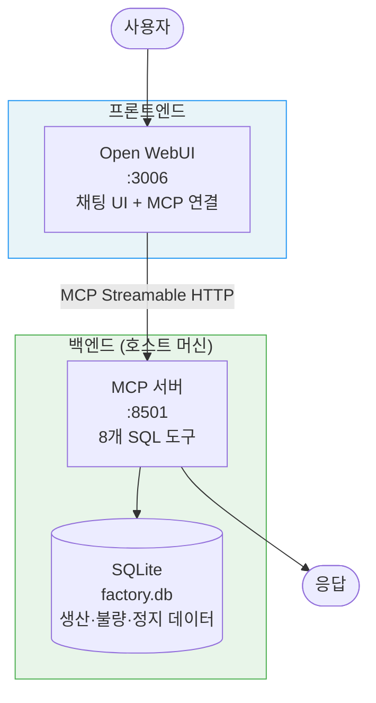
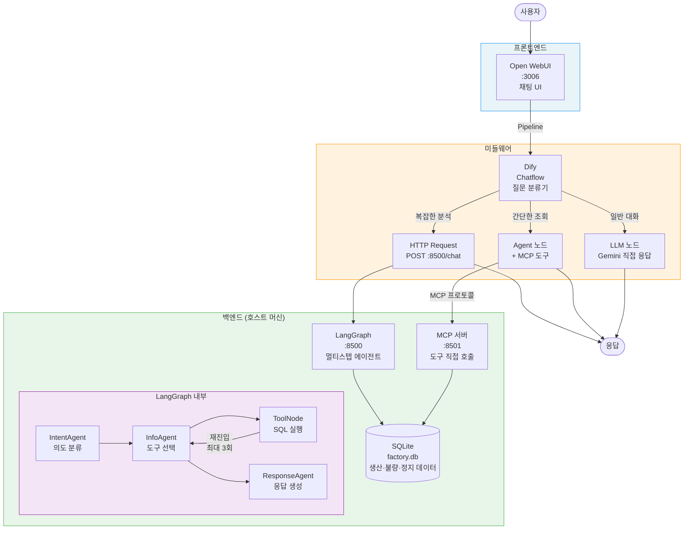
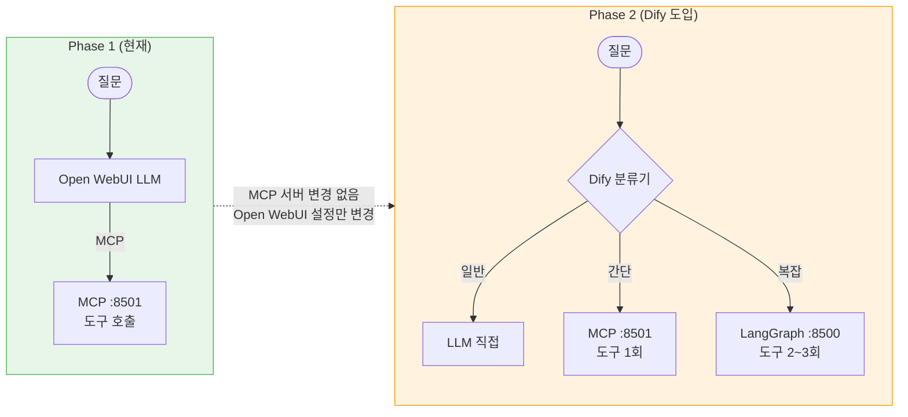

# Factory AI

**자동차 공장 생산 데이터를 자연어로 질의하는 AI 시스템**

"이번 달 소나타 몇 대 만들었어?", "3라인 불량률이 왜 높아?" 같은 질문을 입력하면, AI가 데이터베이스를 조회해서 한국어로 분석 결과를 알려줍니다.

---

## 한눈에 보는 구조

### Phase 1 — 현재 (Dify 없이 바로 사용)

```
사용자: "이번 달 생산 현황 알려줘"
    │
    ▼
┌─ Open WebUI ─────────────────┐  채팅 UI (:3006)
│  Admin → Tools → MCP Servers  │
│  → MCP 연결 추가               │
└────────┬─────────────────────┘
         │ MCP Streamable HTTP
         ▼
┌─ MCP 서버 (:8501) ───────────┐  8개 SQL 도구
│  get_production_summary       │
│  get_defect_stats ...         │
└────────┬─────────────────────┘
         │ SQL
         ▼
┌─ SQLite (factory.db) ────────────────┐
│  가상 자동차 공장 생산 데이터 (2026.02) │
└──────────────────────────────────────┘
```

Open WebUI의 LLM이 MCP 도구를 **직접 선택/호출**합니다. 설정 5분이면 바로 사용 가능.

### Phase 2 — 향후 (Dify 도입 후)

```
사용자: "불량률이 왜 높아?"
    │
    ▼
┌─ Open WebUI ─────────────────┐  채팅 UI (:3006)
└────────┬─────────────────────┘
         │ Pipeline
         ▼
┌─ Dify (질문 분류기) ─────────┐  워크플로 엔진
│                              │
│  ├─ 일반 대화    → LLM 직접   │  "안녕하세요" → 바로 응답
│  ├─ 간단한 조회  → MCP (:8501)│  "오늘 생산 현황" → 도구 1회 호출
│  └─ 복잡한 분석  → LangGraph  │  "불량률이 왜 높아?" → 멀티스텝
│                              │
└────────┬──────────┬──────────┘
         │          │
         ▼          ▼
┌─ MCP (:8501) ─┐  ┌─ LangGraph (:8500) ─┐
│ 도구 직접 호출  │  │ 멀티스텝 에이전트     │
│ (단순 SQL)     │  │ (도구 2~3회 연쇄)    │
└───────┬───────┘  └──────────┬──────────┘
        │                     │
        ▼                     ▼
┌─ SQLite (factory.db) ────────────────┐
│  가상 자동차 공장 생산 데이터 (2026.02) │
└──────────────────────────────────────┘
```

---

## 마이그레이션 로드맵

이 프로젝트는 **점진적으로 진화**하는 구조입니다. MCP 서버를 핵심으로 두고, 나머지는 필요에 따라 추가합니다.

| | Phase 1 (현재) | Phase 2 (Dify 도입 후) |
|---|---|---|
| **경로** | Open WebUI → MCP 직접 | Open WebUI → Dify → MCP + LangGraph |
| **장점** | 설정 간단, 바로 사용 | 3분류 라우팅, 멀티스텝 분석 |
| **변경 범위** | — | Open WebUI에 Pipeline 추가, Dify 셋업 |
| **MCP 서버** | 그대로 유지 | 그대로 유지 |
| **LangGraph** | 미사용 (또는 CLI) | Dify가 복잡한 분석에 활용 |
| **factory.db** | 그대로 유지 | 그대로 유지 |

> **핵심**: Phase 1 → Phase 2 마이그레이션 시 **MCP 서버, LangGraph 서버, factory.db는 아무것도 바뀌지 않습니다**. Open WebUI 설정만 변경하면 됩니다.

---

## 왜 이런 구조인가?

### 각 레이어의 역할

| 레이어 | 역할 | 비유 | Phase |
|--------|------|------|-------|
| **Open WebUI** | 사용자와 대화하는 UI | 은행 창구 (고객 응대) | 1, 2 |
| **MCP 서버** | 8개 SQL 도구를 표준 프로토콜로 노출 | 업무 도구 세트 | 1, 2 |
| **Dify** | 간단한 건 직접 처리, 복잡한 건 전문가에게 라우팅 | 안내 데스크 (업무 분류) | 2 |
| **LangGraph** | 여러 도구를 조합해 복잡한 분석 수행 | 전문 분석가 (실무 처리) | 2 |
| **SQLite** | 생산/불량/정지 데이터 저장 | 서류 보관실 (데이터) | 1, 2 |

### Phase별 처리 흐름

```
Phase 1 (현재):
"오늘 생산 현황"                → Open WebUI LLM → MCP → SQL 1회

Phase 2 (Dify 도입 후):
"안녕하세요"                    → Dify LLM 직접 응답 (빠름)
"오늘 생산 현황"                → Dify → MCP → SQL 1회 (빠름)
"불량률이 왜 높아?"             → Dify → LangGraph → SQL 2~3회 (깊음)
```

### Phase 2의 추가 장점

- **3단계 처리**: 간단한 건 가볍게, 복잡한 건 무겁게 — 자원을 효율적으로 사용
- **노코드 수정**: Dify에서 프롬프트, 분류 규칙, 분기 로직을 GUI로 수정 가능 (코드 변경 없음)
- **관심사 분리**: UI, 라우팅, 분석이 각각 독립되어 한 곳을 바꿔도 나머지에 영향 없음

---

## 목차

1. [기술 스택 소개](#기술-스택-소개) — 각 기술이 뭔지, 왜 쓰는지
2. [전체 아키텍처 상세](#전체-아키텍처-상세)
3. [가상 공장 데이터](#가상-공장-데이터)
4. [빠른 시작 — Phase 1](#빠른-시작--phase-1) — MCP 직접 연결 (지금 바로 사용)
5. [Phase 2: Dify 도입](#phase-2-dify-도입) — 3분류 라우팅 + LangGraph
6. [8개 조회 도구](#8개-조회-도구)
7. [LangGraph 에이전트 동작 원리](#langgraph-에이전트-동작-원리)
8. [API 레퍼런스](#api-레퍼런스)
9. [트러블슈팅](#트러블슈팅)

---

## 기술 스택 소개

이 프로젝트에서 쓰는 기술들을 처음 보는 분을 위해 하나씩 설명합니다.

### Open WebUI — 채팅 인터페이스

ChatGPT 같은 채팅 UI를 **내 서버에 직접 설치**해서 쓸 수 있는 오픈소스 프로젝트입니다. Docker로 실행하면 바로 웹 채팅 화면이 뜹니다.

이 프로젝트에서의 역할: **사용자가 대화하는 창구**. Open WebUI 자체는 데이터 분석을 하지 않고, Dify에게 메시지를 전달합니다.

### Dify — AI 워크플로 빌더

AI 워크플로를 **드래그 앤 드롭**으로 만들 수 있는 플랫폼입니다. 코드를 쓰지 않고도 "이 질문이 오면 → 이쪽으로 보내고, 저 질문이 오면 → 직접 답하기" 같은 로직을 만들 수 있습니다.

이 프로젝트에서의 역할: **안내 데스크**

```
질문 분류기 (Question Classifier)
    ├─ "일반 대화" → Dify의 LLM이 직접 답변 (빠름)
    └─ "공장 데이터 조회" → LangGraph 서버로 전달 (정확함)
```

Dify를 쓰는 이유: 프롬프트를 수정하거나 분류 규칙을 바꿀 때 **코드 배포 없이 웹 GUI에서 바로 변경**할 수 있습니다.

### LangGraph — AI 에이전트 프레임워크

LLM이 **여러 단계를 거쳐 복잡한 작업을 수행**하도록 설계하는 프레임워크입니다.

일반적인 LLM은 "질문 → 응답" 한 번으로 끝나지만, LangGraph는 여러 노드(단계)를 연결하여 LLM이 **스스로 판단하며 단계를 진행**하게 합니다.

```
"소나타 불량률이 높은데 왜 그래?"
    ↓
[IntentAgent]    의도 파악: defect_query
    ↓
[InfoAgent]      도구 선택: get_defect_stats(model="SONATA")
    ↓
[ToolNode]       SQL 실행 → 불량 유형별 결과
    ↓
[InfoAgent]      "도장 불량이 많네, 정지 이력도 확인해보자"
                 → get_downtime_history(line="LINE-1")  ← 자기가 추가 판단!
    ↓
[ToolNode]       SQL 실행 → 정지 이력
    ↓
[ResponseAgent]  두 결과를 종합하여 한국어 응답 생성
```

이 프로젝트에서의 역할: **복잡한 공장 데이터 분석 전담**. 최대 3라운드까지 도구를 반복 호출하며 심층 분석합니다.

### Gemini — LLM (대형 언어 모델)

Google의 **Gemini 2.0 Flash**를 사용합니다. LangGraph 안에서 의도 분류, 도구 선택, 응답 생성을 담당합니다.

### FastAPI — HTTP API 서버

LangGraph 에이전트를 HTTP 서버로 감싸는 Python 웹 프레임워크입니다. Dify가 `POST /chat`으로 호출할 수 있게 합니다.

### SQLite — 데이터베이스

파일 하나(`factory.db`)로 동작하는 경량 데이터베이스. 가상의 자동차 공장 생산 데이터가 저장되어 있습니다.

### FastMCP — MCP 프로토콜 서버 (핵심)

Anthropic의 MCP(Model Context Protocol)로 도구를 직접 노출하는 서버. Phase 1에서는 Open WebUI가 **직접** MCP 도구를 호출하는 핵심 경로이고, Phase 2에서는 Dify Agent 노드가 MCP를 통해 도구를 호출합니다. 두 Phase 모두에서 변함없이 사용되는 **핵심 인프라**입니다.

---

## 전체 아키텍처 상세

### Phase 1 — 현재 (Open WebUI → MCP 직접)



Open WebUI의 LLM이 MCP 도구를 직접 선택/호출합니다. 가장 단순한 구성.

### Phase 2 — 향후 (Open WebUI → Dify → MCP + LangGraph)



### Phase 1 → Phase 2 마이그레이션



### 질문 유형별 흐름 (Phase 2)

#### 1. 일반 대화 → Dify LLM 직접

```
사용자: "안녕하세요"  →  Dify 분류: 일반 대화  →  LLM 직접 응답
```

외부 호출 없이 Dify의 LLM이 바로 답합니다. 빠르고 저렴합니다.

#### 2. 간단한 조회 → Dify + MCP (:8501)

```
사용자: "이번 달 생산 현황"
    ↓ Dify 분류: 간단한 조회
    ↓ Agent 노드 → MCP 도구 선택: get_production_summary(period="this_month")
    ↓ MCP 서버 → SQL 실행 → JSON 결과
    ↓ Dify LLM이 결과를 표로 정리
"📊 2026년 2월 | 1라인 90.7% | 2라인 91.1% | ..."
```

도구 1회 호출로 끝나는 단순 조회. LangGraph를 거치지 않아 빠릅니다.

#### 3. 복잡한 분석 → LangGraph (:8500)

```
사용자: "3라인 불량률이 왜 높아?"
    ↓ Dify 분류: 복잡한 분석
    ↓ HTTP Request → POST :8500/chat
    ↓ LangGraph
       Round 1: get_defect_stats(line="LINE-3")   → 불량 유형 파악
       Round 2: get_downtime_history(line="LINE-3") → 정지 이력 상관관계
       Round 3: 종합 분석 응답 생성
"3라인(EV)의 불량률이 2.15%로 높은 주요 원인은..."
```

LangGraph가 **스스로 판단**하며 도구를 2~3회 연쇄 호출합니다.

---

## 가상 공장 데이터

가상의 자동차 공장 데이터를 사용합니다. `python -m db.seed`로 생성합니다.

### 공장 구성

```
🏭 가상 자동차 공장 (2026년 2월)
│
├── LINE-1: 1라인 (세단)
│   └── 소나타 (SONATA) — 교대당 목표 120대
│
├── LINE-2: 2라인 (SUV)
│   ├── 투싼 (TUCSON) — 교대당 목표 45대
│   └── GV70 — 교대당 목표 35대
│
└── LINE-3: 3라인 (EV)
    └── 아이오닉6 (IONIQ6) — 교대당 목표 60대

🔄 3교대: 주간(06~14시) / 야간(14~22시) / 심야(22~06시)
```

### 데이터베이스 (6개 테이블)

| 테이블 | 행 수 | 설명 |
|--------|-------|------|
| `production_lines` | 3 | 생산 라인 (LINE-1/2/3) |
| `models` | 4 | 차종 (소나타/투싼/GV70/아이오닉6) |
| `shifts` | 3 | 교대 (주간/야간/심야) |
| `daily_production` | ~252 | 일별 생산 실적 |
| `defects` | ~170 | 불량 상세 (도장/조립/용접/전장) |
| `downtime` | ~18 | 설비 정지 이력 |

---

## 빠른 시작 — Phase 1

> Phase 1은 MCP 서버를 Open WebUI에 직접 연결하는 가장 간단한 구성입니다.
> Dify 없이 바로 사용할 수 있습니다.

### 1. 클론 및 환경 설정

```bash
git clone https://github.com/donchoru/factory-ai.git
cd factory-ai

python -m venv .venv
source .venv/bin/activate
pip install -r requirements.txt
```

### 2. 데이터베이스 생성

```bash
python -m db.seed
```

### 3. MCP 서버 실행

```bash
python mcp_server.py    # :8501에서 대기
```

### 4. Open WebUI에서 MCP 연결

1. Open WebUI (http://localhost:3006) 접속
2. **Admin** → **Settings** → **Tools** → **MCP Servers**
3. **Add** 클릭
4. URL: `http://host.docker.internal:8501/mcp`
5. **Save** → 8개 도구 자동 인식

> Open WebUI가 Docker에서 돌고 있으면 `host.docker.internal`, 로컬이면 `localhost` 사용

### 5. 사용하기

채팅에서 질문하면 Open WebUI의 LLM이 MCP 도구를 자동으로 선택/호출합니다:

```
사용자: 이번 달 생산 현황
AI: [get_production_summary 호출]
    📊 2026년 2월 생산 현황
    | 라인 | 목표 | 실적 | 달성률 |
    | 1라인 | 9,600 | 8,704 | 90.7% |
    ...
```

### 6. CLI로 직접 테스트 (선택)

서버 없이 LangGraph를 직접 테스트할 수도 있습니다.

```bash
echo "GEMINI_API_KEY=your-api-key-here" > .env   # Gemini 키 (LangGraph용)
python main.py
```

```
질문> 이번 달 생산 현황
[production_query]
📊 2026년 2월 생산 현황입니다...
```

---

## Phase 2: Dify 도입

> Dify가 셋업되면, 질문을 **3가지로 분류**하여 각각 다른 방식으로 처리합니다.
> MCP 서버와 LangGraph 서버는 **변경 없이** 그대로 사용합니다.

### 마이그레이션 체크리스트

- [ ] Dify 서버 실행 (Docker 또는 클라우드)
- [ ] LangGraph 서버 실행: `python server.py` (:8500)
- [ ] Dify에 MCP 서버 연결 (Tools → MCP → `http://host.docker.internal:8501/mcp`)
- [ ] Dify에 Custom Tool 등록 (`dify/openapi.yaml` → Server URL: `:8500`)
- [ ] Chatflow 생성 (3분류)
- [ ] Open WebUI Pipeline을 Dify API로 전환
- [ ] Open WebUI에서 기존 MCP 직접 연결 제거 (선택)

### Chatflow 구조

```
[시작] → [질문 분류기] ─┬─ 일반 대화   → [LLM 노드] ──────────────→ [끝]
                        ├─ 간단한 조회 → [Agent 노드 + MCP 도구] ──→ [끝]
                        └─ 복잡한 분석 → [HTTP Request :8500] ────→ [끝]
```

| 클래스 | 처리 | 예시 |
|--------|------|------|
| 일반 대화 | LLM 노드 (직접 응답) | "안녕", "MCP가 뭐야?" |
| 간단한 조회 | Agent 노드 + MCP 도구 | "오늘 생산 현황", "라인 상태" |
| 복잡한 분석 | HTTP Request → LangGraph | "불량률이 왜 높아?", "개선 방안" |

### Open WebUI Pipeline 설정

`open-webui/docker-compose.yml`에서 Dify API 정보를 설정합니다:

```yaml
pipelines:
  environment:
    - DIFY_API_URL=http://host.docker.internal    # Dify 서버 주소
    - DIFY_API_KEY=app-xxxxxxxxxxxx                # Dify에서 발급받은 API 키
```

```bash
cd open-webui && docker compose up -d
```

> 상세 Chatflow 설정 가이드 (노드별 설정값 포함): [`dify/README.md`](dify/README.md)

---

## 8개 조회 도구

LangGraph가 사용하는 SQL 조회 도구들입니다. Dify를 통해 자연어로 질문하면 LangGraph가 적절한 도구를 자동 선택합니다.

| # | 도구 | 설명 | 질문 예시 |
|---|------|------|----------|
| 1 | `get_daily_production` | 일별 생산 실적 | "2월 15일 LINE-1 실적" |
| 2 | `get_production_summary` | 기간별 생산 요약 | "이번 달 생산 현황" |
| 3 | `get_defect_stats` | 불량 통계 | "3라인 불량 현황" |
| 4 | `get_line_status` | 라인 현황 | "어떤 라인이 제일 잘 돌아가?" |
| 5 | `get_downtime_history` | 설비 정지 이력 | "설비 정지 이력 보여줘" |
| 6 | `get_model_comparison` | 차종별 비교 | "차종별 실적 비교" |
| 7 | `get_shift_analysis` | 교대별 분석 | "교대별 생산량 비교" |
| 8 | `get_production_trend` | 생산 추이 | "최근 2주 생산 추이" |

### 파라미터 참조표

| 한국어 | ID | 카테고리 |
|--------|-----|---------|
| 1라인, 세단라인 | `LINE-1` | 라인 |
| 2라인, SUV라인 | `LINE-2` | 라인 |
| 3라인, EV라인 | `LINE-3` | 라인 |
| 소나타 | `SONATA` | 차종 |
| 투싼 | `TUCSON` | 차종 |
| GV70 | `GV70` | 차종 |
| 아이오닉6 | `IONIQ6` | 차종 |
| 주간 | `DAY` | 교대 |
| 야간 | `NIGHT` | 교대 |
| 심야 | `MIDNIGHT` | 교대 |

---

## LangGraph 에이전트 동작 원리

LangGraph 서버(:8500)가 복잡한 질문을 처리하는 과정입니다.

### StateGraph 구조

```
         ┌──────────────┐
         │ IntentAgent  │ ← Step 1: 의도 분류 (6가지)
         └──────┬───────┘
                │
        ┌───────┴───────┐
        ▼               ▼
 ┌────────────┐  ┌────────────┐
 │ InfoAgent  │  │  Respond   │ ← general_chat이면 바로 여기로
 │ (도구선택)  │  │ (직접응답)  │
 └──────┬─────┘  └────────────┘
        │
   ┌────┴────┐
   ▼         ▼
┌───────┐ ┌────────────┐
│ Tools │ │  Respond   │ ← 도구 불필요하면 여기로
│ (SQL) │ └────────────┘
└───┬───┘
    │
    └──→ InfoAgent (재진입, 최대 3라운드)
```

### 도구 체이닝 예시

복잡한 질문에서는 LangGraph가 **스스로 판단하여** 도구를 여러 번 호출합니다:

```
질문: "소나타 불량률이 높은데 왜 그래?"

Round 1: get_defect_stats(model="SONATA")
         → 도장 42%, 조립 31% ...

Round 2: get_downtime_history(line="LINE-1")     ← LLM이 추가 분석 결정
         → 도장 부스 필터 교체 정비 이력 ...

최종: "소나타 불량의 주요 원인은 도장 불량(42%)이며,
      LINE-1 도장 부스 정비 이후에도 지속되고 있어 추가 점검이 필요합니다."
```

Dify의 단순 라우팅으로는 이런 **멀티스텝 추론**을 할 수 없어서, 복잡한 질문은 LangGraph에게 맡기는 것입니다.

---

## MCP 서버 — 핵심 인프라

MCP 서버(:8501)는 **모든 Phase에서 변함없이 사용**되는 핵심 인프라입니다.

| Phase | MCP 서버의 역할 |
|-------|----------------|
| **Phase 1** (현재) | Open WebUI가 **직접** MCP 도구를 호출 |
| **Phase 2** (Dify 도입) | Dify Agent 노드가 MCP를 통해 도구 호출 |

```bash
python mcp_server.py    # :8501에서 대기 (어느 Phase든 동일)
```

> 상세 가이드 (MCP 프로토콜, 도구 상세, 트러블슈팅): [`docs/MCP_GUIDE.md`](docs/MCP_GUIDE.md)

---

## 프로젝트 구조

```
factory-ai/
│
├── server.py               # LangGraph 서버 (:8500) — Dify가 호출
├── mcp_server.py            # MCP 서버 (:8501) — 보너스 경로
├── main.py                 # CLI 테스트용
├── config.py               # 설정 (DB 경로, Gemini 키)
│
├── agents/                 # LangGraph 에이전트
│   ├── state.py            #   상태 타입 정의
│   ├── prompts.py          #   시스템 프롬프트 (의도분석/정보조회)
│   ├── intent_agent.py     #   IntentAgent — 의도 분류
│   ├── info_agent.py       #   InfoAgent + ResponseAgent
│   └── message_trimmer.py  #   메시지 토큰 관리
│
├── graph/
│   └── workflow.py         # StateGraph 정의 (노드/엣지/라우팅)
│
├── tools/
│   └── factory_tools.py    # 8개 SQL 도구
│
├── db/
│   ├── connection.py       # SQLite 유틸 (query 함수)
│   ├── schema.sql          # 6테이블 스키마
│   └── seed.py             # 가상 데이터 생성기
│
├── dify/
│   ├── openapi.yaml        # Dify Custom Tool 스펙
│   └── README.md           # Dify Chatflow 설정 가이드
│
├── open-webui/
│   ├── docker-compose.yml  # Open WebUI + Pipeline (Docker)
│   └── pipelines/
│       └── factory_agent.py # Dify API 호출 Pipeline
│
├── docs/
│   └── MCP_GUIDE.md        # MCP 서버 상세 가이드
│
├── requirements.txt
└── factory.db              # SQLite 데이터베이스
```

---

## API 레퍼런스

### LangGraph 서버 (:8500)

Dify에서 호출하는 엔드포인트입니다.

```bash
# 자연어 질의
curl -X POST http://localhost:8500/chat \
  -H "Content-Type: application/json" \
  -d '{"message": "이번 달 생산 현황", "session_id": "test"}'

# 응답
# {"response": "📊 2026년 2월...", "intent": "production_query", ...}

# 헬스체크
curl http://localhost:8500/health

# 세션 초기화
curl -X POST "http://localhost:8500/reset?session_id=test"
```

### MCP 서버 (:8501)

```bash
# MCP 핸드셰이크 (Open WebUI가 자동 처리)
curl -X POST http://localhost:8501/mcp \
  -H "Content-Type: application/json" \
  -H "Accept: application/json, text/event-stream" \
  -d '{"jsonrpc":"2.0","id":1,"method":"initialize",...}'
```

---

## 트러블슈팅

### Dify에서 LangGraph 연결 실패

```
# LangGraph 서버가 실행 중인지 확인
curl http://localhost:8500/health

# Dify가 Docker 안이면 host.docker.internal 사용
# ✗ http://localhost:8500
# ✓ http://host.docker.internal:8500
```

### Gemini API 키 오류

```bash
# .env 파일 확인
cat .env
# GEMINI_API_KEY=your-key-here
```

### 포트 충돌

```bash
lsof -i :8500
kill $(lsof -ti:8500)
```

### factory.db가 없을 때

```bash
python -m db.seed
```

### 로그 확인

```bash
tail -f logs/server-err.log    # LangGraph 서버
tail -f logs/mcp-err.log       # MCP 서버
```

---

## 포트 요약

| 서비스 | 포트 | 역할 | Phase |
|--------|------|------|-------|
| MCP (FastMCP) | `8501` | 8개 SQL 도구 (MCP 프로토콜) | 1, 2 |
| Open WebUI | `3006` | 채팅 UI | 1, 2 |
| LangGraph + FastAPI | `8500` | 멀티스텝 AI 에이전트 | 2 |
| Pipelines | `9099` | Open WebUI → Dify 중계 | 2 |

---

## 기술 스택 요약

| 기술 | 역할 | Phase |
|------|------|-------|
| **Open WebUI** | 채팅 UI | 1, 2 |
| **FastMCP** | MCP 서버 (도구 노출) | 1, 2 |
| **SQLite** | 데이터베이스 | 1, 2 |
| **Dify** | 라우팅 + 간단한 응답 | 2 |
| **LangGraph** | 멀티스텝 에이전트 | 2 |
| Gemini 2.0 Flash | LLM | 1 (Open WebUI), 2 (LangGraph) |
| FastAPI | HTTP 서버 | 2 (LangGraph 래퍼) |
| Docker | 컨테이너 | 1, 2 |
